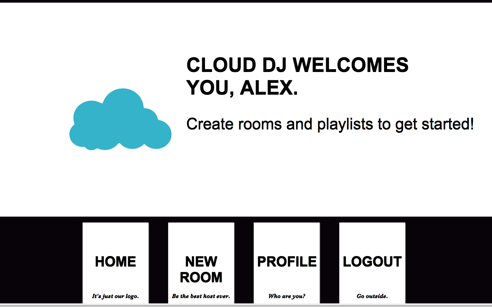
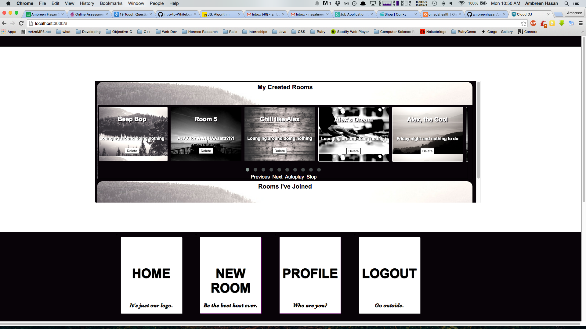
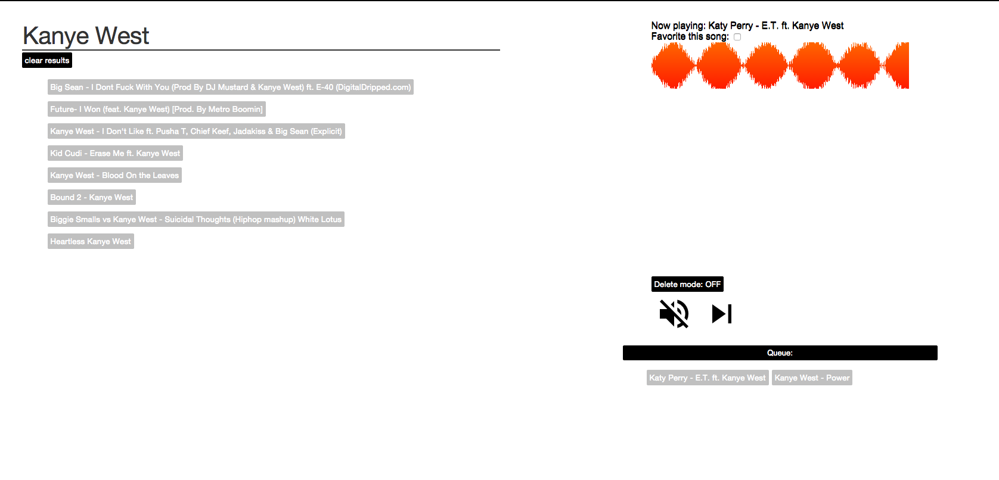

Cloud DJ
========

A cloud party where you can share sounds with your friends and others by creating collaborative playlists.

## Team Members
* [Ambreen Hasan](https://github.com/ambreenhasan)
* [Michael Teevan](https://github.com/mike6838)
* [Alexandra Trost](https://github.com/AlexTrost)
* [Daniel Yee](https://github.com/DanYee910)

## Technologies
* Ruby on Rails
* PostgreSQL
* JavaScript and jQuery
* Soundcloud API
* Waveform.js
* Atomic CSS and Sass
* RSpec for testing
* Simplecov for test coverage (71% test coverage)

## Schema

## Screenshots
### Main User Page

### User Profile
#### view of created rooms on user profile

### Room View
#### search song with SoundCloud, add to a queue, view waveform; delete, mute, and pause current song

